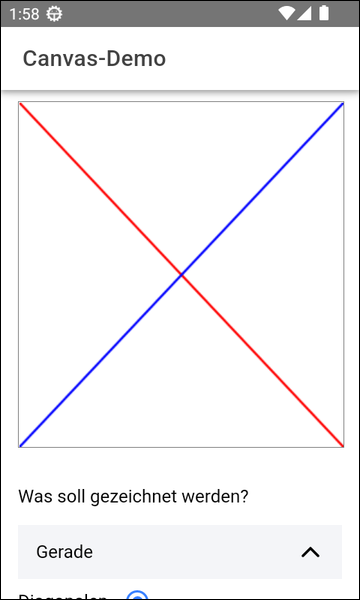
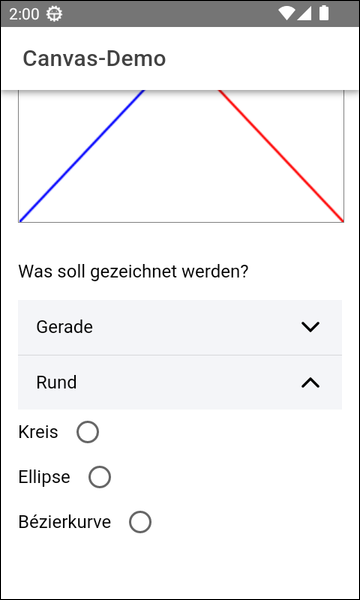

# Drawing on the HTML Canvas in an Ionic app #

 

Dieses Repository enthält eine [Ionic-App](https://ionicframework.com/) mit [Angular](https://angular.io/), die demonstriert, wie
das [HTML Canvas](https://developer.mozilla.org/en-US/docs/Web/API/Canvas_API/Tutorial) zum Zeichnen verwendet werden kann.

 

----

## Screenshots ##

 

 &nbsp;  

 

----

## License ##

 

See the [LICENSE file](LICENSE.md) for license rights and limitations (BSD 3-Clause License) for the files in this repository.

 
